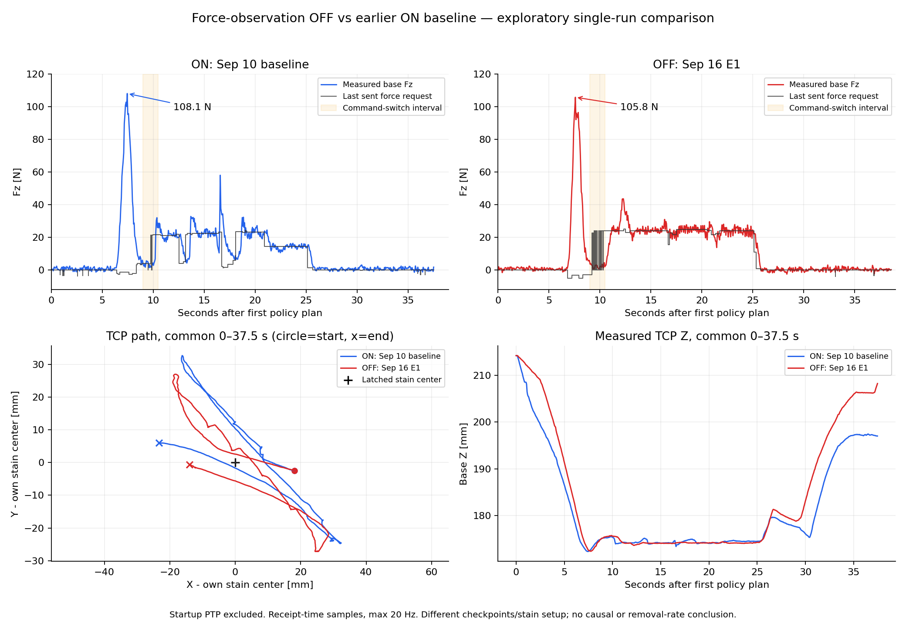

# 2026-09-20 OFF 실행 분석

OFF 실행(16:23:41–16:24:24)은 시작 위치 확인 후 추론 10회와 서비스 스트리밍을 진행했다.
서비스 응답 479건은 전부 성공이며, 정상적인 키보드 중단 후 로그가 모두 저장됐다.
이는 명령 전달/로그 저장 확인이며 물리 작업 완료 판정은 아니다.

이번 OFF는 힘 관측을 제거한 모델이다. 9D 힘 action과 힘 제어는 유지된다.
비교 ON은 9/10 기존 성공 ckpt이고, OFF는 9/16 E1 재학습 ckpt다.
실행 파라미터 차이는 ckpt_dir/use_force_observation/metrics_run_tag뿐이지만,
동일한 학습 실험의 두 조건이 아니므로 힘 관측 효과의 인과 추정은 할 수 없다.

## 동일 시간 구간의 정량 비교

각 실행의 첫 정책 plan 생성 완료를 0초로 하고 공통 0–37.5초를 사용한다.
아래 평균·표준편차·임계값 이상 시간은 측정 receipt 간격으로 가중했다.

| 지표 | ON (9/10 baseline) | OFF (9/16 E1) |
|---|---:|---:|
| 초기 이동 제외 정책 실행 시간 [s] | 37.54 | 38.57 |
| 추론 횟수 | 9.00 | 10.00 |
| 공통 구간 평균 Fz [N] | 11.11 | 12.63 |
| 공통 구간 Fz 표준편차 [N] | 15.98 | 16.72 |
| 관측 최대 Fz [N] | 108.09 | 105.80 |
| Fz >= 3 N 시간 [s] (물리 접촉 판정 아님) | 18.79 | 17.61 |
| Fz >= 3 N 구간 평균 [N] | 21.44 | 26.29 |
| Fz >= 50 N 시간 [s] | 1.09 | 0.92 |
| 공통 구간 XY 이동 거리 [mm] | 205.02 | 190.35 |
| 9–10.5 s 힘 명령 0/비0 전환 횟수 | 5.00 | 30.00 |

## 해석

- OFF는 ON보다 공통 구간 평균 Fz가 높고, Fz >= 3 N인 시간은 짧았다.
  임계값은 분석용이며, 의도적인 이탈/가공 구간이 구분되지 않아 성공률이나 접촉 실패율로 해석하지 않는다.
- 15–25초의 평균/표준편차는 ON 18.17 ± 7.00 N,
  OFF 23.96 ± 2.61 N이었다.
  이 구간은 OFF의 변동이 더 작아, OFF가 전 구간에서 더 불안정했다고 결론낼 수 없다.
- 두 조건 모두 첫 plan 후 약 7.5초에 100 N 이상의 큰 Fz를 기록했다.
  해당 시점의 마지막 전송 Fz 요청은 ON -1.37 N,
  OFF -3.19 N이었다. 따라서 정책이 100 N 목표를 보냈다는 뜻은 아니다.
  초기 진입 궤적/힘 좌표·부호/실제 제어기 적용값을 확인할 대상이다. 원인은 이 로그만으로 확정하지 않는다.
- OFF의 9–10.5초에는 힘 요청 31건에서 0과 약 23–24 N 사이 전환이 30회 있었다.
  0 N 요청의 이유는 기존 접촉 판정에 따른 force-zero gate였다. ON의 같은 구간 전환은 5회다.
  20Hz 저장은 이보다 빠른 센서 변화를 모두 보존하지 않아 접촉 판정 변화의 원인을 재구성할 수 없다.
- OFF의 safety_limit 이벤트 21건은 전부 이 gate 기록이다. 확인된 hard safety stop으로 세면 안 된다.
- 초기 위치의 이동은 분석에서 제외했다. XY는 각 실행의 얼룩 중심을 뺀 상대 좌표로 표시했으며,
  원점 차이 약 5.08 mm를 결과 편차로 오인하지 않는다.

## 기록 및 해석 한계

- OFF 위치 759행, 힘 759행, commands 1,961행 저장. writer 오류/큐 드롭/종료 대기 모두 0.
  의도한 20Hz 샘플링 생략은 큐 손실과 구별하며 DDS 손실은 측정하지 않았다.
- force command는 commands.csv의 PTP9D_STREAM_SET_FORCE만 사용했다.
  PTP9D_STREAM_APPEND의 force 열 0은 사용되지 않는 자리이며, legacy.csv에는 이 0이 섞여 있어
  그 열 전체로 힘 추종 오차를 계산하면 잘못된 결과가 된다. 실제 제어기 적용 힘은 별도 미검증이다.
- Fz는 base 좌표 축 성분이다. 표면 법선/부호/접촉 면적이 미검증이라 압력이나 실제 법선력으로 바꾸지 않는다.
- 최종 이미지에 검은 자국이 남아 있다. 시작/종료 카메라 자세가 달라 정렬된 제거 면적률은 계산하지 않았다.
  시편 ID는 양쪽 모두 default이며 시편 재준비 여부는 로그에 없다.
- 자동 removal heatmap은 미보정 k=1과 TCP 속도를 사용한 상대 지표다.
  회전 공구 RPM/실제 재료 제거량을 측정하지 않았고 각 그림의 격자 영역도 달라 실제 제거율 비교에 쓰지 않았다.
- ON 1회와 OFF 1회이므로 재현성/통계적 우열을 주장할 수 없다.

## 원본

- ON: `/home/eunseop/nrs_imitation/logs/inference_metrics/rel_single_90deg_best_20260920T160636_1789887996648993205_r3lvdifh`
- OFF: `/home/eunseop/nrs_imitation/logs/inference_metrics/IL_minus_F_E1_off_20260920T162341_1789889021414718505_kkmoieb_`
- OFF 최종 이미지: `/home/eunseop/nrs_imitation/logs/inference_metrics/IL_minus_F_E1_off_20260920T162341_1789889021414718505_kkmoieb_/snapshots/final_image.png`
- OFF 영상: `/home/eunseop/Videos/Screencasts/polishing_inference_20260920_162346_FLOW_IL_minus_F_E1_off.webm`
  (별도 ffprobe 검사: 10fps, 385 frames, 38.5 s, 오류 없이 파일 마무리됨)

다음 비교는 대응하는 9/16 E1 ON ckpt, 동일 시편 준비/시작 상태/평가 구간으로 반복해야 한다.
분석 재실행: `python3 reports/20260920_force_observation_comparison/analyze.py`
